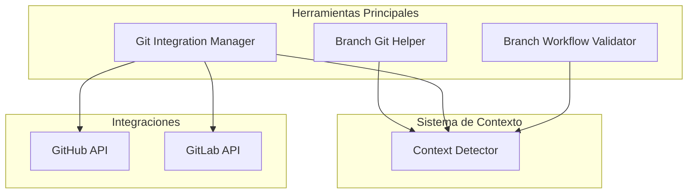
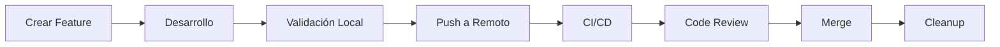
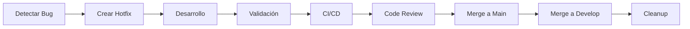
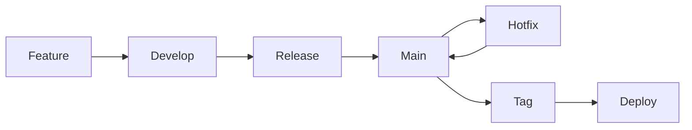

# 📚 Git Branch Tools - Manual de Usuario Completo

## 📑 Tabla de Contenidos

- [🎯 Introducción](#-introducción)
  - [Visión General](#visión-general)
  - [Filosofía y Principios](#-filosofía-y-principios)
  - [Arquitectura](#-arquitectura)
- [🔧 Componentes](#-componentes)
  - [Branch Git Helper 🌿](#branch-git-helper-)
  - [Git Integration Manager 🔌](#git-integration-manager-)
  - [Branch Workflow Validator ✅](#branch-workflow-validator-)
  - [Quality Manager 🎯](#quality-manager-)
- [🔄 Workflows](#-workflows)
  - [Feature Development](#feature-development)
  - [Hotfix](#hotfix)
  - [Release](#release)
  - [Empresarial](#empresarial)
- [🌍 Contextos](#-contextos)
  - [LOCAL](#local)
  - [HYBRID](#hybrid)
  - [REMOTE](#remote)
- [🔌 Integración](#-integración)
  - [APIs de Plataformas Git](#apis-de-plataformas-git)
  - [CI/CD](#cicd)
  - [Hooks](#hooks)
  - [Validaciones](#validaciones)

## 🎯 Introducción

### Visión General

Git Branch Tools es un ecosistema integrado de herramientas diseñado para optimizar y automatizar la gestión de ramas y flujos de trabajo en Git. Su característica distintiva es su capacidad de adaptación contextual inteligente, que le permite detectar y ajustarse automáticamente a las características específicas de cada proyecto, ya sea un repositorio local, un entorno híbrido o un proyecto remoto con múltiples contribuidores. Esta adaptabilidad se manifiesta en la aplicación dinámica de reglas de validación, la gestión automática de ramas y la integración nativa con plataformas populares como GitHub y GitLab.

### 🧠 Filosofía y Principios

**Adaptabilidad Contextual**

El sistema implementa un mecanismo sofisticado de detección automática que analiza múltiples factores del proyecto, incluyendo la configuración de remotos, el número de contribuidores y la presencia de sistemas de CI/CD. Basado en este análisis, clasifica el proyecto en uno de tres contextos (LOCAL, HYBRID o REMOTE) y ajusta dinámicamente sus validaciones y comportamientos para adaptarse a las necesidades específicas de cada entorno.

**Validación Inteligente**

Una vez detectado el contexto, el sistema aplica un conjunto de reglas de validación cuidadosamente definidas y adaptadas a cada escenario. Estas reglas abarcan desde validaciones básicas de formato para proyectos locales hasta controles estrictos de calidad y flujo de trabajo para entornos remotos con múltiples contribuidores, asegurando que cada proyecto mantenga los estándares apropiados para su nivel de complejidad.

**Integración con Plataformas**

El ecosistema ofrece una integración nativa y robusta con las plataformas de Git más populares, GitHub y GitLab. Esta integración permite la automatización de tareas comunes, la sincronización bidireccional de estados, y el aprovechamiento de las APIs específicas de cada plataforma para optimizar los flujos de trabajo y mejorar la colaboración entre equipos.

### 🏗️ Arquitectura



## 🔧 Componentes

### Branch Git Helper 🌿

Herramienta CLI central del ecosistema que proporciona una interfaz unificada para la gestión inteligente de ramas Git. Implementa detección automática de contexto (LOCAL/HYBRID/REMOTE) y adapta dinámicamente sus validaciones, flujos de trabajo y comportamientos según el entorno detectado. Ofrece comandos intuitivos para la creación y gestión de ramas, integración nativa con plataformas Git (GitHub/GitLab/etc), y un sistema de aliases para optimizar la productividad diaria.

#### Comandos Disponibles:

```bash
# Comandos básicos
branch-git-helper.py status                            # Mostrar estado del repositorio
branch-git-helper.py -p /path/to/repo status           # Estado de repositorio específico

# Creación de ramas
branch-git-helper.py feature "nueva-autenticacion"     # Crear rama de feature
branch-git-helper.py fix "corregir-validacion"         # Crear rama de fix
branch-git-helper.py hotfix "vulnerabilidad-critica"   # Crear rama de hotfix
branch-git-helper.py docs "actualizar-readme"          # Crear rama de documentación
branch-git-helper.py refactor "optimizar-queries"      # Crear rama de refactorización
branch-git-helper.py test "cobertura-api"              # Crear rama de tests
branch-git-helper.py chore "actualizar-deps"           # Crear rama de mantenimiento

# Opciones para creación de ramas
--no-remote    # Crear sin configurar el upstream remoto
--no-sync      # Crear sin sincronizar con remoto
-p, --repo-path PATH  # Especificar ruta del repositorio

# Gestión de estado de ramas
branch-git-helper.py state merged              # Marcar rama como mergeada
branch-git-helper.py state deleted             # Marcar rama como eliminada
branch-git-helper.py state merged -d           # Mergear y eliminar rama
branch-git-helper.py state deleted -d          # Marcar como eliminada y borrar local

# Gestión de contexto
branch-git-helper.py force-context LOCAL       # Forzar contexto LOCAL
branch-git-helper.py force-context HYBRID      # Forzar contexto HYBRID
branch-git-helper.py force-context REMOTE      # Forzar contexto REMOTE
branch-git-helper.py force-context AUTO        # Restaurar detección automática

# Gestión de aliases
branch-git-helper.py install-aliases           # Instalar aliases de Git persistentes
branch-git-helper.py uninstall-aliases         # Remover aliases
```

#### Aliases Disponibles:

```bash
# Aliases para proyecto actual
git new-feature "descripción"              # Crear feature
git new-fix "descripción"                  # Crear fix
git new-hotfix "descripción"               # Crear hotfix
git new-docs "descripción"                 # Crear rama de docs
git new-refactor "descripción"             # Crear rama de refactor
git new-test "descripción"                 # Crear rama de tests
git new-chore "descripción"                # Crear rama de mantenimiento
git branch-status                          # Estado del proyecto

# Aliases para gestión de estado
git state merged                           # Marcar rama como mergeada
git state deleted                          # Marcar rama como eliminada
git merged-d                               # Mergear y eliminar rama
git deleted-d                              # Marcar como eliminada y borrar local

# Aliases para proyectos específicos
git new-feature-in /path/to/project "desc" # Crear feature en proyecto
git new-fix-in ../mi-proyecto "desc"       # Crear fix en proyecto
git branch-status-in /path/to/project      # Estado de proyecto
```

#### Notas Importantes:

- Las ramas nuevas se crean en estado WIP
- El estado WIP se mantiene hasta que los commits se mergean
- El contexto se detecta automáticamente según la configuración
- Se pueden forzar contextos específicos según necesidades
- Los aliases permiten acceso rápido desde cualquier directorio
- El comando state permite cambiar el estado de una rama
- La opción --delete elimina la rama después de marcar su estado
- Los tags se propagan al remoto para mantener consistencia
- CI/CD solo aplica en la rama main

#### Estados de Rama:

- **WIP** (Work In Progress): Rama en desarrollo activo
- **MERGED**: Rama cuyos commits han sido mergeados a su rama base
- **DELETED**: Rama eliminada localmente pero mantenida en remoto como backup

#### Tipos de Rama:

- **feature**: Nuevas características y funcionalidades
- **fix**: Correcciones de errores y bugs
- **hotfix**: Correcciones urgentes en producción
- **docs**: Documentación y cambios en docs
- **refactor**: Refactorización de código sin cambios funcionales
- **test**: Añadir o mejorar tests
- **chore**: Tareas de mantenimiento y build

### Git Integration Manager 🔌

El Git Integration Manager es una herramienta especializada que centraliza y simplifica la gestión de integraciones con plataformas Git. Su propósito principal es proporcionar una interfaz unificada para interactuar con múltiples plataformas de control de versiones (GitHub, GitLab, Gitea, Forgejo y Bitbucket) sin necesidad de conocer sus APIs específicas.

La herramienta implementa una capa de abstracción robusta que permite:

- Configurar y gestionar protecciones de ramas de manera consistente
- Establecer políticas de merge y push automáticamente
- Gestionar la configuración de CI/CD de forma estandarizada
- Mantener la consistencia en la configuración entre diferentes plataformas
- Automatizar tareas comunes de integración y despliegue

Esta abstracción facilita la migración entre plataformas y asegura que las mejores prácticas de integración continua se apliquen de manera uniforme, independientemente de la plataforma Git utilizada.

#### Gestión de CI/CD

La gestión CI/CD se centra en la configuración inicial y mantenimiento de los archivos de configuración de CI/CD para diferentes plataformas. En resumen, es una herramienta de configuración inicial básica que ayuda a establecer la estructura de archivos necesaria para CI/CD, pero no es un gestor completo de CI/CD como podría sugerir su nombre.

##### Configuración Inicial (cicd apply):

```bash
git-integration-manager.py cicd apply                             # Aplicar configuración CI/CD
```

- Copia plantillas predefinidas desde la carpeta scaffold/ci/ al proyecto
- Crea las carpetas necesarias según la plataforma (.github/, .gitlab/, etc.)
- No configura pipelines complejos ni workflows personalizados
- Solo establece una estructura básica de archivos

Ejemplos de Uso:

```bash
# Aplicar la configuración CI/CD de una plataforma específica
git-integration-manager.py cicd apply --platform github

# Aplicar configuración CI/CD forzando la sobrescritura
git-integration-manager.py cicd apply -f

# Aplicar configuración CI/CD para un tipo de proyecto específico
git-integration-manager.py cicd apply --type python

# Aplicar configuración CI/CD completa con todos los parámetros
git-integration-manager.py cicd apply --platform gitlab --type node -f -p /ruta/al/proyecto
```

##### Limpieza (cicd reset):

```bash
git-integration-manager.py cicd reset                             # Resetear configuración CI/CD
```

- Elimina las carpetas de configuración de CI/CD
- No afecta a los pipelines existentes en la plataforma

Ejemplos de Uso:

```bash
# Resetear la configuración CI/CD de una plataforma específica
git-integration-manager.py cicd reset --platform github

# Resetear la configuración CI/CD de un proyecto en una ruta específica
git-integration-manager.py cicd reset -p /ruta/al/proyecto
```

##### Migración (cicd migrate):

```bash
git-integration-manager.py cicd migrate PLATFORM                  # Migrar CI/CD a otra plataforma
```

- Mueve la configuración básica entre plataformas
- No migra pipelines activos ni historial de CI/CD
- Solo copia las plantillas correspondientes a la nueva plataforma

Ejemplo de uso:

```bash
# Migrar desde la plataforma actual a GitHub
git-integration-manager.py cicd migrate --platform github

# Migrar a GitLab forzando la sobrescritura
git-integration-manager.py cicd migrate --platform gitlab -f

# Migrar a una plataforma específica con ruta personalizada
git-integration-manager.py cicd migrate --platform gitea -p /ruta/al/proyecto
```

#### Integración y Gestión de Calidad

El sistema de integración y calidad de **Git Branch Tools** ofrece cuatro (4) comandos principales que trabajan en conjunto: integrate, set-quality-level, quality-status y list-commit-formats. El comando integrate automatiza la integración de ramas feature al flujo principal, manejando Pull Requests, verificando CI/CD y realizando fusiones seguras. Se adapta al contexto del proyecto (local, híbrido o remoto) y permite simulaciones antes de aplicar cambios.

```bash
git-integration-manager.py integrate [branch_name] [opciones]
```

El sistema de calidad, gestionado por set-quality-level y monitoreado por quality-status, establece estándares de calidad con tres niveles (minimal, standard y strict) y múltiples formatos de commit (minimal, simple, conventional, semantic, angular). Cada nivel determina la rigurosidad de las validaciones y hooks aplicados, permitiendo adaptar el sistema a las necesidades específicas del proyecto. El comando list-commit-formats muestra los formatos disponibles y sus características, facilitando la elección del más apropiado.

```bash
# Configuración de nivel de calidad
git-integration-manager.py set-quality-level --level <nivel> [--commit-format <formato>]

git-integration-manager.py quality-status                         # Mostrar estado de calidad
git-integration-manager.py list-commit-formats                    # Listar formatos de commit disponibles
```

### Branch Workflow Validator ✅

Validador de workflows que asegura el cumplimiento de las mejores prácticas según el contexto. Se integra con Git hooks para validación automática.

#### Comandos Disponibles:

```bash
# Validación manual
branch-workflow-validator --operation commit           # Valida antes de commit
branch-workflow-validator --operation push            # Valida antes de push
branch-workflow-validator --operation merge           # Valida antes de merge

# Modos especiales
branch-workflow-validator --strict                    # Modo estricto, falla en warnings
branch-workflow-validator --hook pre-commit           # Ejecuta como Git hook
branch-workflow-validator --verbose                   # Muestra detalles de validación
```

#### Notas Importantes:

- Se instala automáticamente como Git hook con git-integration-manager
- Las validaciones se adaptan al contexto detectado
- El modo verbose es útil para debugging de reglas
- Los hooks pueden deshabilitarse temporalmente con --no-verify

#### Validaciones por Contexto:

- **LOCAL**: Solo validaciones críticas
- **HYBRID**: Formato de nombres, ramas protegidas
- **REMOTE**: Validación completa incluyendo GPG y PR

### Quality Manager 🎯

Gestor centralizado de configuración y calidad que mantiene la consistencia entre herramientas. Proporciona configuraciones adaptativas según el contexto.

#### Configuraciones Disponibles:

```bash
# Niveles de validación
warning                                       # Solo advertencias, no bloquea
moderate                                      # Bloquea en errores críticos
strict                                        # Bloquea en cualquier violación

# Opciones configurables
enforce_branch_naming                         # Valida formato de nombres
require_pr                                    # Requiere PR para merge
require_linear_history                        # Prohibe merge commits
require_upstream                              # Requiere tracking remoto
allow_direct_push_to_main                     # Permite push directo a main
```

#### Notas Importantes:

- La configuración se propaga automáticamente a todas las herramientas
- Los cambios de contexto actualizan la configuración dinámicamente
- Las configuraciones personalizadas se preservan entre actualizaciones
- El sistema mantiene un balance entre flexibilidad y mejores prácticas

## 🔄 Workflows

### Feature Development



```bash
# 1. Crear rama de feature
git bh create feature/nueva-funcionalidad

# 2. Desarrollo y commits
git add .
git commit -m "feat: implementa nueva funcionalidad"

# 3. Push y validación
git push origin feature/nueva-funcionalidad

# 4. Integración
git-integration-manager integrate feature/nueva-funcionalidad
```

### Hotfix



```bash
# 1. Crear hotfix desde main
git bh create hotfix/correccion-urgente

# 2. Desarrollo y commits
git add .
git commit -m "fix: corrige vulnerabilidad crítica"

# 3. Push y validación
git push origin hotfix/correccion-urgente

# 4. Integración
git-integration-manager integrate hotfix/correccion-urgente
```

### Release


```bash
# 1. Crear rama de release
git bh create release/v1.2.0

# 2. Actualizar versiones
git add .
git commit -m "chore: actualiza versión a 1.2.0"

# 3. Push y validación
git push origin release/v1.2.0

# 4. Integración
git-integration-manager integrate release/v1.2.0
```

### Empresarial



```bash
# 1. Crear feature desde develop
git bh create feature/nueva-funcionalidad --base develop

# 2. Desarrollo y commits
git add .
git commit -m "feat: implementa nueva funcionalidad"

# 3. Push y validación
git push origin feature/nueva-funcionalidad

# 4. Integración
git-integration-manager integrate feature/nueva-funcionalidad --target develop
```

## 🌍 Contextos

### LOCAL

Contexto para proyectos personales o de desarrollo individual. Máxima flexibilidad con validaciones mínimas.

#### Características:

- Sin protecciones de rama
- Validaciones básicas de formato
- Push directo permitido
- Sin requerimientos de PR
- Sin validación de GPG

#### Configuración:

```bash
# Forzar contexto LOCAL
git bh force-context LOCAL

# Verificar configuración
git bh status
```

### HYBRID

Contexto para equipos pequeños o proyectos con colaboración limitada. Balance entre flexibilidad y control.

#### Características:

- Protección básica en main/develop
- Validaciones de formato y estructura
- PR recomendado pero no obligatorio
- Validación opcional de GPG
- CI/CD básico

#### Configuración:

```bash
# Forzar contexto HYBRID
git bh force-context HYBRID

# Configurar protección
git-integration-manager protection apply HYBRID
```

### REMOTE

Contexto para proyectos empresariales o de código abierto. Máximo control y validaciones estrictas.

#### Características:

- Protección estricta de ramas
- Validaciones completas
- PR obligatorio
- Validación de GPG requerida
- CI/CD completo
- Revisión de código obligatoria

#### Configuración:

```bash
# Forzar contexto REMOTE
git bh force-context REMOTE

# Configurar protección
git-integration-manager protection apply REMOTE
```

## 🔌 Integración

### APIs de Plataformas Git

Integración nativa con múltiples plataformas Git a través de una capa de abstracción unificada.

#### Plataformas Soportadas:

- GitHub
- GitLab
- Gitea
- Forgejo
- Bitbucket

#### Características:

- Detección automática de plataforma
- APIs unificadas
- Migración transparente
- Configuración adaptativa

### CI/CD

Gestión de integración continua y despliegue continuo adaptada a cada plataforma.

#### Características:

- Plantillas predefinidas
- Configuración automática
- Migración entre plataformas
- Adaptación contextual

### Hooks

Sistema de hooks Git para validación automática de operaciones.

#### Hooks Disponibles:

- pre-commit
- commit-msg
- pre-push
- post-merge

### Validaciones

Sistema de validación adaptativo según el contexto del proyecto.

#### Tipos de Validación:

- Formato de nombres
- Estructura de commits
- Protección de ramas
- GPG
- CI/CD
- Code Review
