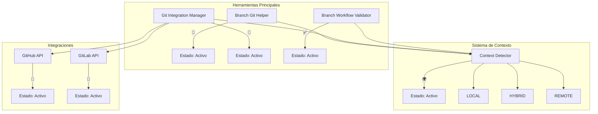
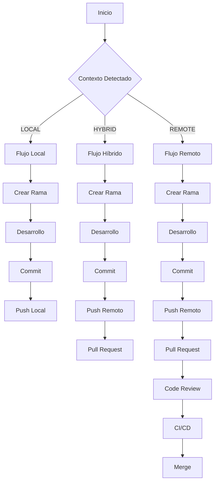
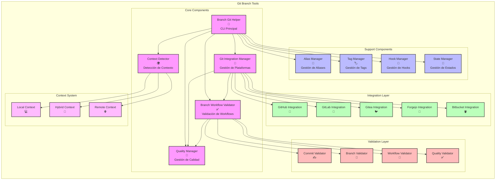
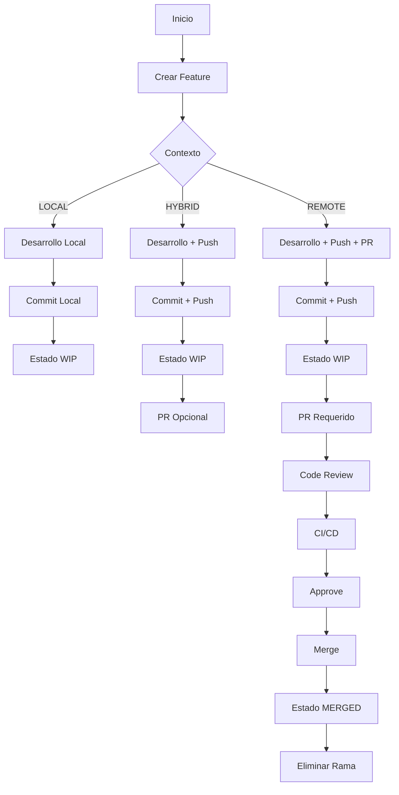
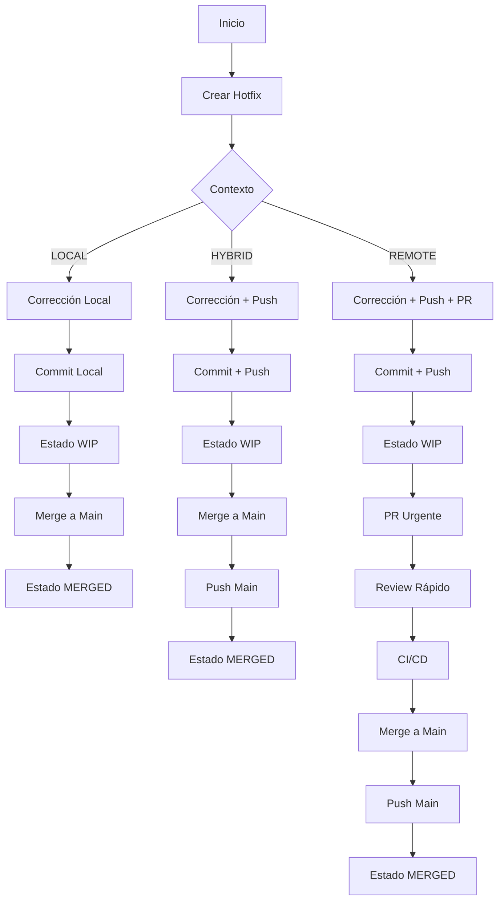
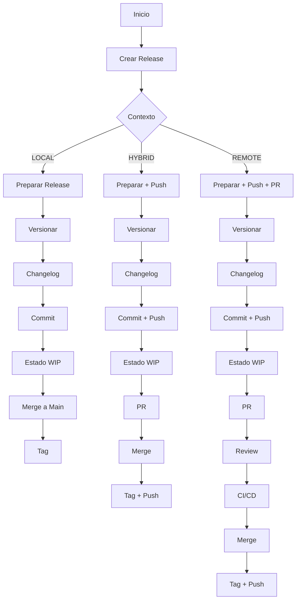

# 📚 Guía del Ecosistema Git Branch Tools

<!-- PARSEABLE_METADATA_START
purpose: Guía completa del ecosistema Git Branch Tools con mejoras visuales y de navegación
technology: Git, Python, Markdown, Mermaid
status: Development
PARSEABLE_METADATA_END -->

## 📑 Tabla de Contenidos

### 🎯 Introducción
- [Visión General](#visión-general)
- [Filosofía y Principios](#filosofía-y-principios)
  - [Adaptabilidad Contextual](#adaptabilidad-contextual)
  - [Validación Inteligente](#validación-inteligente)
  - [Integración con Plataformas](#integración-con-plataformas)

### 🏗️ Arquitectura
- [Diagrama de Arquitectura](#diagrama-de-arquitectura)
- [Contextos](#contextos)
- [Flujos de Trabajo](#flujos-de-trabajo)
- [Flujos por Contexto](#flujos-por-contexto)
- [Validaciones Adaptivas](#validaciones-adaptivas)
- [Transiciones de Contexto](#transiciones-de-contexto)
- [Integración con CI/CD](#integracion-con-ci/cd)

### 🔧 Componentes
- [Diagrama de Componentes](#diagrama-de-componentes)
- [Estado de Componentes](#estado-de-componentes)
- [Branch Git Helper](#branch-git-helper)
- [Git Integration Manager](#git-integration-manager)
- [Quality Manager](#quality-manager)

### 🔄 Workflows Detallados
- [Development](#development)
- [Hotfix](#hotfix)
- [Release](#release)

### 🔍 Troubleshooting
- [Problemas Comunes y Soluciones](#problemas-comunes-y-soluciones)
- [Comandos de Diagnóstico](#comandos-de-diagnostico)
- [Recuperación de Errores](#recuperacion-de-errores)

---

## 🎯 Introducción

### Visión General

El ecosistema Git Branch Tools es un conjunto de herramientas diseñadas para estandarizar y optimizar el flujo de trabajo con Git. Proporciona una capa de abstracción inteligente que se adapta al contexto del proyecto (local, híbrido o remoto) y automatiza las tareas más comunes de gestión de ramas.

### 🧠 Filosofía y Principios

**Adaptabilidad Contextual**

El sistema implementa un mecanismo sofisticado de detección automática que analiza múltiples factores del proyecto, incluyendo la configuración de remotos, el número de contribuidores y la presencia de sistemas de CI/CD. Basado en este análisis, clasifica el proyecto en uno de tres contextos (LOCAL, HYBRID o REMOTE) y ajusta dinámicamente sus validaciones y comportamientos para adaptarse a las necesidades específicas de cada entorno.

**Validación Inteligente**

Una vez detectado el contexto, el sistema aplica un conjunto de reglas de validación cuidadosamente definidas y adaptadas a cada escenario. Estas reglas abarcan desde validaciones básicas de formato para proyectos locales hasta controles estrictos de calidad y flujo de trabajo para entornos remotos con múltiples contribuidores, asegurando que cada proyecto mantenga los estándares apropiados para su nivel de complejidad.

**Integración con Plataformas**

El ecosistema ofrece una integración nativa y robusta con las plataformas de Git más populares, GitHub y GitLab. Esta integración permite la automatización de tareas comunes, la sincronización bidireccional de estados, y el aprovechamiento de las APIs específicas de cada plataforma para optimizar los flujos de trabajo y mejorar la colaboración entre equipos.

## 🏗️ Arquitectura

### Diagrama de Arquitectura



La estructura del ecosistema **Git Branch Tools** está organizada en capas funcionales que trabajan de manera cohesiva para proporcionar una experiencia de gestión de ramas robusta y adaptable. En el núcleo del sistema se encuentran los componentes principales que manejan las operaciones fundamentales: el Branch Git Helper actúa como la interfaz de línea de comandos principal, el Git Integration Manager gestiona las interacciones con las plataformas de Git, el Branch Workflow Validator asegura el cumplimiento de los flujos de trabajo definidos, y el Quality Manager se especializa en la validación y mantenimiento de los estándares de calidad a nivel de commit, enfocándose principalmente en el contexto local.

Estos componentes principales se complementan con una capa de soporte que incluye gestores especializados para aliases, tags, hooks y estados, proporcionando funcionalidades adicionales que facilitan y enriquecen la experiencia del usuario. La capa de integración establece conexiones nativas con las principales plataformas de Git, incluyendo GitHub, GitLab, Gitea, Forgejo y Bitbucket, permitiendo una sincronización bidireccional y la automatización de tareas específicas de cada plataforma.

Finalmente, la capa de validación implementa un conjunto de validadores que aseguran la calidad y consistencia de los commits, ramas, flujos de trabajo y métricas de calidad, adaptándose dinámicamente según el contexto detectado del proyecto. Esta arquitectura modular y extensible permite que el sistema se adapte a diferentes escenarios de uso mientras mantiene un alto nivel de control y automatización.


### 🌍 Contextos

Los contextos en Git Branch Tools representan diferentes niveles de complejidad y requisitos en la gestión de ramas, diseñados para adaptarse a las necesidades específicas de cada proyecto. Estos contextos son detectados automáticamente por el sistema basándose en factores como la configuración de remotos, el número de contribuidores, la presencia de sistemas de CI/CD y las políticas de ramas establecidas.

| Característica | LOCAL | HYBRID | REMOTE |
|----------------|-------|---------|---------|
| **Tipo de Proyecto** | Personal | Equipo Pequeño | Empresarial |
| **Ramas Protegidas** | main/master | main/master/develop | main/master/develop/staging |
| **Requiere Upstream** | No | Opcional | Sí |
| **Requiere PR** | No | Recomendado | Sí |
| **Validaciones** | Básicas | Moderadas | Estrictas |
| **Aprobaciones** | No | 1 | 2+ |
| **CI/CD** | No | Opcional | Sí |
| **Historia Lineal** | No | Opcional | Sí |
| **Commits Firmados** | No | Opcional | Sí |

El objetivo principal de los contextos es proporcionar un marco de trabajo flexible que se ajuste automáticamente a las necesidades del proyecto, aplicando las validaciones y restricciones apropiadas según el nivel de complejidad detectado. Esto permite que el sistema funcione de manera óptima tanto en proyectos personales como en entornos empresariales, manteniendo siempre los estándares de calidad necesarios para cada caso.

| Característica | LOCAL | HYBRID | REMOTE |
|----------------|-------|--------|--------|
| **Detección** | - Sin remoto<br>- Un solo contribuidor<br>- Sin CI/CD | - Con remoto<br>- Pocos contribuidores<br>- CI/CD opcional | - Múltiples remotos<br>- Muchos contribuidores<br>- CI/CD requerido |
| **Validaciones** | - Formato básico<br>- Estados de rama<br>- Tipos permitidos | - Formato estricto<br>- Estados y tipos<br>- Referencias a issues | - Formato Angular<br>- Todos los estados<br>- Todos los tipos<br>- Firma requerida |
| **Workflow** | - Local simple<br>- Push opcional<br>- Sin PR | - Local + Remoto<br>- Push requerido<br>- PR opcional | - Local + Remoto<br>- Push requerido<br>- PR + Review<br>- CI/CD |
| **Casos de Uso** | - Proyectos personales<br>- Prototipos<br>- Experimentos | - Equipos pequeños<br>- Proyectos internos<br>- Desarrollo inicial | - Proyectos empresariales<br>- Open Source<br>- Equipos grandes |

El contexto LOCAL está diseñado para proyectos personales o pequeños, donde el desarrollador trabaja principalmente de forma aislada. En este contexto, las validaciones son básicas y el sistema permite una mayor flexibilidad en la gestión de ramas, enfocándose en la productividad individual y la rapidez de desarrollo.

El contexto HYBRID está orientado a equipos pequeños o medianos que necesitan mantener un balance entre desarrollo local y colaboración remota, implementando validaciones moderadas y permitiendo la integración opcional con sistemas de CI/CD.

El contexto REMOTE está optimizado para entornos empresariales o proyectos de gran escala, donde la colaboración, la trazabilidad y la calidad del código son fundamentales. Este contexto implementa validaciones estrictas, requiere la integración con sistemas de CI/CD, y enfatiza el cumplimiento de políticas de ramas definidas a nivel organizacional. Cada contexto se adapta dinámicamente a las necesidades del proyecto, asegurando que las herramientas y validaciones aplicadas sean siempre apropiadas para el nivel de complejidad detectado.

###  🔄 Flujos de Trabajo



Los flujos de trabajo en Git Branch Tools implementan un sistema de validación y control adaptativo que se ajusta automáticamente según el contexto detectado. Este sistema garantiza que las operaciones de desarrollo cumplan con los estándares y políticas definidas para cada entorno, mientras mantiene la flexibilidad necesaria para diferentes escenarios de uso.

En el contexto LOCAL, las operaciones se centran en la gestión eficiente de ramas locales, permitiendo una rápida iteración y desarrollo sin la necesidad de conexión constante a repositorios remotos. Este modo es ideal para desarrolladores que trabajan en entornos aislados o con conexión intermitente.

En el contexto HYBRID, el sistema equilibra las operaciones locales con la sincronización periódica con repositorios remotos. Este modo es particularmente útil para equipos distribuidos que necesitan mantener cierta independencia en su trabajo mientras mantienen la capacidad de compartir cambios de manera controlada. El sistema implementa validaciones inteligentes para asegurar que los cambios locales cumplan con los estándares del proyecto antes de permitir la sincronización.

El contexto REMOTE está optimizado para entornos de integración continua y despliegue, donde la colaboración en tiempo real y la trazabilidad son fundamentales. En este modo, el sistema enfatiza la validación estricta de cambios, la integración con sistemas de CI/CD, y el cumplimiento de políticas de ramas definidas a nivel organizacional. Las operaciones se realizan con un enfoque en la seguridad y la consistencia del código.

Cada contexto implementa un conjunto específico de validaciones y flujos de trabajo que se adaptan a las necesidades del entorno. El sistema detecta automáticamente el contexto apropiado basándose en la configuración del repositorio, la conectividad disponible, y las políticas definidas, permitiendo una transición fluida entre los diferentes modos de operación según sea necesario.

### Flujos por Contexto

#### 🌿 Flujo LOCAL
El flujo LOCAL está optimizado para desarrollo individual y rápido:

1. **Creación de Rama**
   - Validación básica de formato
   - Sin restricciones de upstream
   - Estados de rama simplificados

2. **Desarrollo**
   - Commits locales sin validación estricta
   - Estados de trabajo flexibles
   - Sin requerimientos de CI/CD

3. **Integración**
   - Push directo a ramas locales
   - Sin requerimientos de PR
   - Merge simplificado

#### 🔄 Flujo HYBRID
El flujo HYBRID equilibra desarrollo local y colaboración:

1. **Creación de Rama**
   - Validación moderada de formato
   - Upstream opcional
   - Estados de rama extendidos

2. **Desarrollo**
   - Commits con validación básica
   - Estados de trabajo estructurados
   - CI/CD opcional

3. **Integración**
   - Push a remoto requerido
   - PR recomendado
   - Review opcional

#### 🌐 Flujo REMOTE
El flujo REMOTE está diseñado para entornos empresariales:

1. **Creación de Rama**
   - Validación estricta de formato
   - Upstream requerido
   - Estados de rama completos

2. **Desarrollo**
   - Commits con validación Angular
   - Estados de trabajo rigurosos
   - CI/CD requerido

3. **Integración**
   - Push a remoto obligatorio
   - PR + Review requeridos
   - Merge con aprobaciones

### Validaciones Adaptativas

El sistema implementa validaciones que se ajustan según el contexto:

| Validación | LOCAL | HYBRID | REMOTE |
|------------|-------|--------|---------|
| Formato de Rama | Básico | Estricto | Angular |
| Estados | Simplificados | Extendidos | Completos |
| Referencias | Opcionales | Recomendadas | Requeridas |
| Firma | No | Opcional | Sí |
| CI/CD | No | Opcional | Sí |

### Transiciones de Contexto

El sistema maneja transiciones entre contextos de manera fluida:

1. **Detección Automática**
   - Análisis de configuración
   - Evaluación de conectividad
   - Verificación de políticas

2. **Adaptación de Validaciones**
   - Ajuste de reglas
   - Actualización de estados
   - Modificación de flujos

3. **Migración de Datos**
   - Preservación de historial
   - Actualización de metadatos
   - Sincronización de estados

### Integración con CI/CD

La integración con sistemas de CI/CD se adapta según el contexto:

| Característica | LOCAL | HYBRID | REMOTE |
|----------------|-------|--------|---------|
| Ejecución | Manual | Opcional | Automática |
| Validaciones | Básicas | Extendidas | Completas |
| Notificaciones | No | Opcionales | Requeridas |
| Despliegue | Manual | Semi-auto | Automático |

## 🔧 Componentes

### Diagrama de Componentes



### 🎯 Estado de Componentes

| Componente | Estado | Versión | Estabilidad |
|------------|--------|---------|-------------|
| Branch Git Helper 🌿 |  | 0.2.0 |  |
| Git Integration Manager 🔌 |  | 0.2.0 |  |
| Branch Workflow Validator ✅ |  | 0.2.0 |  |
| Quality Manager 🌍 |  | 0.2.0 |  |


### 🌿 Branch Git Helper

Herramienta CLI central del ecosistema que proporciona una interfaz unificada para la gestión inteligente de ramas Git. Implementa detección automática de contexto (LOCAL/HYBRID/REMOTE) y adapta dinámicamente sus validaciones, flujos de trabajo y comportamientos según el entorno detectado. Ofrece comandos intuitivos para la creación y gestión de ramas, integración nativa con plataformas Git (GitHub/GitLab/etc), y un sistema de aliases para optimizar la productividad diaria.

#### Comandos Disponibles:

```bash
# Comandos básicos
branch-git-helper.py status                            # Mostrar estado del repositorio
branch-git-helper.py -p /path/to/repo status           # Estado de repositorio específico

# Creación de ramas
branch-git-helper.py feature "nueva-autenticacion"     # Crear rama de feature
branch-git-helper.py fix "corregir-validacion"         # Crear rama de fix
branch-git-helper.py hotfix "vulnerabilidad-critica"   # Crear rama de hotfix
branch-git-helper.py docs "actualizar-readme"          # Crear rama de documentación
branch-git-helper.py refactor "optimizar-queries"      # Crear rama de refactorización
branch-git-helper.py test "cobertura-api"              # Crear rama de tests
branch-git-helper.py chore "actualizar-deps"           # Crear rama de mantenimiento

# Opciones para creación de ramas
--no-remote    # Crear sin configurar el upstream remoto
--no-sync      # Crear sin sincronizar con remoto
-p, --repo-path PATH  # Especificar ruta del repositorio

# Gestión de estado de ramas
branch-git-helper.py state merged              # Marcar rama como mergeada
branch-git-helper.py state deleted             # Marcar rama como eliminada
branch-git-helper.py state merged -d           # Mergear y eliminar rama
branch-git-helper.py state deleted -d          # Marcar como eliminada y borrar local

# Gestión de contexto
branch-git-helper.py force-context LOCAL       # Forzar contexto LOCAL
branch-git-helper.py force-context HYBRID      # Forzar contexto HYBRID
branch-git-helper.py force-context REMOTE      # Forzar contexto REMOTE
branch-git-helper.py force-context AUTO        # Restaurar detección automática

# Gestión de aliases
branch-git-helper.py install-aliases           # Instalar aliases de Git persistentes
branch-git-helper.py uninstall-aliases         # Remover aliases
```

#### Aliases Disponibles:

```bash
# Aliases para proyecto actual
git new-feature "descripción"              # Crear feature
git new-fix "descripción"                  # Crear fix
git new-hotfix "descripción"               # Crear hotfix
git new-docs "descripción"                 # Crear rama de docs
git new-refactor "descripción"             # Crear rama de refactor
git new-test "descripción"                 # Crear rama de tests
git new-chore "descripción"                # Crear rama de mantenimiento
git branch-status                          # Estado del proyecto

# Aliases para gestión de estado
git state merged                           # Marcar rama como mergeada
git state deleted                          # Marcar rama como eliminada
git merged-d                               # Mergear y eliminar rama
git deleted-d                              # Marcar como eliminada y borrar local

# Aliases para proyectos específicos
git new-feature-in /path/to/project "desc" # Crear feature en proyecto
git new-fix-in ../mi-proyecto "desc"       # Crear fix en proyecto
git branch-status-in /path/to/project      # Estado de proyecto
```

#### Estados de Rama:

| Estado | Comportamiento Local | Comportamiento Remoto | Tags | Transiciones Permitidas |
|--------|---------------------|----------------------|------|------------------------|
| **WIP** | Rama activa en desarrollo | Rama activa en remoto | `state/wip` | → MERGED, → DELETED |
| **MERGED** | Rama mergeada localmente | Rama mergeada en remoto | `state/merged` | → DELETED |
| **DELETED** | Rama eliminada localmente | Rama mantenida en remoto como backup | `state/deleted` | (Estado final) |

**Notas sobre Estados:**
- El estado WIP es el predeterminado al crear una nueva rama
- Los estados se sincronizan automáticamente entre local y remoto
- Los tags de estado se propagan al remoto para mantener consistencia
- La opción `-d` en los comandos de estado elimina la rama local después de marcar su estado

#### Tipos de Rama:


| Tipo de Rama | Descripción | Rama Base | Reglas de Validación | Ejemplo de Nombre |
|------|-------------|----------------------|---------------------|-------------------|
| **feature** | Nuevas características | develop, main | - Formato: `feature/nombre-descripcion`<br>- No espacios<br>- Solo minúsculas y guiones | `feature/nueva-autenticacion` |
| **fix** | Correcciones de bugs | develop, main | - Formato: `fix/nombre-descripcion`<br>- No espacios<br>- Solo minúsculas y guiones | `fix/correccion-validacion` |
| **hotfix** | Correcciones urgentes | main, master | - Formato: `hotfix/nombre-descripcion`<br>- No espacios<br>- Solo minúsculas y guiones | `hotfix/vulnerabilidad-critica` |
| **docs** | Documentación | develop, main | - Formato: `docs/nombre-descripcion`<br>- No espacios<br>- Solo minúsculas y guiones | `docs/actualizar-readme` |
| **refactor** | Refactorización | develop, main | - Formato: `refactor/nombre-descripcion`<br>- No espacios<br>- Solo minúsculas y guiones | `refactor/optimizar-queries` |
| **test** | Tests | develop, main | - Formato: `test/nombre-descripcion`<br>- No espacios<br>- Solo minúsculas y guiones | `test/cobertura-api` |
| **chore** | Mantenimiento | develop, main | - Formato: `chore/nombre-descripcion`<br>- No espacios<br>- Solo minúsculas y guiones | `chore/actualizar-deps` |

**Notas sobre Tipos:**
- Cada tipo tiene una rama base prioritaria definida
- El sistema intentará usar la primera rama base disponible
- Las reglas de validación se aplican según el contexto del proyecto
- Los nombres deben ser descriptivos y seguir el formato especificado

##### Ejemplos Detallados de Uso

1. **Creación de Rama Feature**:
```bash
# Crear una rama feature para nueva autenticación
branch-git-helper.py feature "nueva-autenticacion"

# Crear feature sin configurar remoto
branch-git-helper.py feature "nueva-autenticacion" --no-remote

# Crear feature en repositorio específico
branch-git-helper.py feature "nueva-autenticacion" -p /ruta/al/proyecto
```

2. **Gestión de Estado**:
```bash
# Marcar rama como mergeada
branch-git-helper.py state merged feature/nueva-autenticacion

# Marcar como mergeada y eliminar local
branch-git-helper.py state merged feature/nueva-autenticacion -d

# Marcar como eliminada
branch-git-helper.py state deleted feature/nueva-autenticacion
```

3. **Gestión de Contexto**:
```bash
# Forzar contexto local para desarrollo offline
branch-git-helper.py force-context LOCAL

# Restaurar detección automática
branch-git-helper.py force-context AUTO
```

### Git Integration Manager 🔌

El Git Integration Manager es una herramienta especializada que centraliza y simplifica la gestión de integraciones con plataformas Git. Su propósito principal es proporcionar una interfaz unificada para interactuar con múltiples plataformas de control de versiones (GitHub, GitLab, Gitea, Forgejo y Bitbucket) sin necesidad de conocer sus APIs específicas.

La herramienta implementa una capa de abstracción robusta que permite:

- Configurar y gestionar protecciones de ramas de manera consistente
- Establecer políticas de merge y push automáticamente
- Gestionar la configuración de CI/CD de forma estandarizada
- Mantener la consistencia en la configuración entre diferentes plataformas
- Automatizar tareas comunes de integración y despliegue

Esta abstracción facilita la migración entre plataformas y asegura que las mejores prácticas de integración continua se apliquen de manera uniforme, independientemente de la plataforma Git utilizada.

#### Gestión de CI/CD

La gestión CI/CD se centra en la configuración inicial y mantenimiento de los archivos de configuración de CI/CD para diferentes plataformas. En resumen, es una herramienta de configuración inicial básica que ayuda a establecer la estructura de archivos necesaria para CI/CD, pero no es un gestor completo de CI/CD como podría sugerir su nombre.

##### Configuración Inicial (cicd apply):

```bash
git-integration-manager.py cicd apply                             # Aplicar configuración CI/CD
```

- Copia plantillas predefinidas desde la carpeta scaffold/ci/ al proyecto
- Crea las carpetas necesarias según la plataforma (.github/, .gitlab/, etc.)
- No configura pipelines complejos ni workflows personalizados
- Solo establece una estructura básica de archivos

Ejemplos de Uso:

```bash
# Aplicar la configuración CI/CD de una plataforma específica
git-integration-manager.py cicd apply --platform github

# Aplicar configuración CI/CD forzando la sobrescritura
git-integration-manager.py cicd apply -f

# Aplicar configuración CI/CD para un tipo de proyecto específico
git-integration-manager.py cicd apply --type python

# Aplicar configuración CI/CD completa con todos los parámetros
git-integration-manager.py cicd apply --platform gitlab --type node -f -p /ruta/al/proyecto
```

##### Limpieza (cicd reset):

```bash
git-integration-manager.py cicd reset                             # Resetear configuración CI/CD
```

- Elimina las carpetas de configuración de CI/CD
- No afecta a los pipelines existentes en la plataforma

Ejemplos de Uso:

```bash
# Resetear la configuración CI/CD de una plataforma específica
git-integration-manager.py cicd reset --platform github

# Resetear la configuración CI/CD de un proyecto en una ruta específica
git-integration-manager.py cicd reset -p /ruta/al/proyecto
```

##### Migración (cicd migrate):

```bash
git-integration-manager.py cicd migrate PLATFORM                  # Migrar CI/CD a otra plataforma
```

- Mueve la configuración básica entre plataformas
- No migra pipelines activos ni historial de CI/CD
- Solo copia las plantillas correspondientes a la nueva plataforma

Ejemplo de uso:

```bash
# Migrar desde la plataforma actual a GitHub
git-integration-manager.py cicd migrate --platform github

# Migrar a GitLab forzando la sobrescritura
git-integration-manager.py cicd migrate --platform gitlab -f

# Migrar a una plataforma específica con ruta personalizada
git-integration-manager.py cicd migrate --platform gitea -p /ruta/al/proyecto
```

#### Integración y Gestión de Calidad

El sistema de calidad de **Git Branch Tools** implementa tres (3) niveles de calidad progresivos, cada uno con sus propias validaciones y requisitos. Estos niveles permiten adaptar el rigor del sistema a las necesidades específicas del proyecto.

**Niveles de Gestión de Calidad**

| Nivel | Validaciones | Formatos de Commit | Hooks | CI/CD |
|-------|-------------|-------------------|-------|-------|
|&nbsp;**minimal** |&nbsp;Formato básico de nombre<br> Estado de rama<br> Tipos permitidos |&nbsp;minimal<br> simple |&nbsp;pre-commit básico |&nbsp;Opcional |
|&nbsp;**standard** |&nbsp;Todas las de minimal<br> Longitud de mensaje<br> Referencias a issues<br> Conventional commits |&nbsp;conventional<br> semantic |&nbsp;pre-commit<br> post-commit<br> pre-push |&nbsp;Requerido |
|&nbsp;**strict** |&nbsp;Todas las de standard<br> Validación de tests<br> Cobertura de código<br> Documentación<br> Angular commits |&nbsp;angular |&nbsp;Todos los hooks<br> Validación de firma<br> Validación de autor |&nbsp;Requerido + Revisión |

Los formatos de commit son reglas estandarizadas que definen la estructura y contenido de los mensajes de commit en Git. Cada formato tiene diferentes niveles de rigurosidad y complejidad, desde el minimal que solo requiere un tipo y descripción básica, hasta el angular que incluye cuerpo detallado, footer y manejo de breaking changes. La elección del formato adecuado depende del nivel de calidad del proyecto y las necesidades específicas del equipo, permitiendo desde una comunicación simple hasta una documentación exhaustiva de los cambios realizados.

**Validaciones para Formatos para Git Commit**

| Tipo de Formato | Estructura del Formato | Ejemplo | Nivel Recomendado |
|---------|-------------|---------|-------------------|
| **minimal** | Formtato básico:<br>&nbsp;`tipo: descripción` |`fix: corrige validación de email` |&nbsp;minimal |
| **simple** | Formato con scope:<br>&nbsp;`tipo(scope): descripción` |`feat(auth): añade validación 2FA` |&nbsp;minimal |
| **conventional** | Conventional Commits con cuerpo y footer:<br>&nbsp;`tipo(scope): descripción` |`fix(auth): corrige validación de email`<br>`- Añade validación de dominio`<br>`- Corrige regex`<br>`Fixes #123` |&nbsp;standard |
| **semantic** | Semantic Versioning con versión y breaking changes:<br>&nbsp;`[TIPO(scope)] descripción` | `[FEAT(#123)] implementa 2FA`<br>`BREAKING CHANGE: requiere nueva configuración` |&nbsp;standard |
| **angular** | Angular Commit Guidelines con cuerpo, footer y breaking changes :<br>&nbsp;`tipo(scope): descripción`| `feat(auth): implementa 2FA`<br>`- Añade autenticación por app`<br>`- Implementa QR code`<br>`BREAKING CHANGE: requiere nueva configuración`<br>`Closes #123` |&nbsp;strict |

El sistema de integración y calidad de **Git Branch Tools** ofrece cuatro (4) comandos principales que trabajan en conjunto que permiten simulaciones antes de aplicar cambios.

##### INTEGRATE

```bash
git-integration-manager.py integrate [branch_name] [opciones]
```

El comando `integrate` automatiza el proceso de integración de ramas feature al flujo principal del proyecto. Sus principales funciones son:

1. **Gestión de Pull Requests**:
   - Crea automáticamente PRs en la plataforma Git configurada
   - Verifica el estado de los PRs existentes
   - Maneja la aprobación y revisión según el nivel de calidad

2. **Verificación de CI/CD**:
   - Ejecuta y monitorea los pipelines de CI/CD
   - Verifica que todos los tests pasen
   - Valida la cobertura de código si está configurada

3. **Fusión Segura**:
   - Realiza merge automático si todas las validaciones pasan
   - Maneja conflictos de forma interactiva
   - Actualiza las ramas según el flujo de trabajo

4. **Adaptación al Contexto**:
   - LOCAL: Integración directa sin PR
   - HYBRID: Opción de crear PR
   - REMOTE: Requiere PR y revisión

##### SET QUALITY LEVEL

```bash
# Configuración de nivel de calidad
git-integration-manager.py set-quality-level --level <nivel> [--commit-format <formato>]
```

El comando `set-quality-level` configura el nivel de calidad y el formato de commit del repositorio. Sus principales funciones son:

1. **Configuración de Nivel**:
   - Establece el nivel de calidad (minimal/standard/strict)
   - Configura las validaciones correspondientes
   - Activa/desactiva hooks según el nivel
   - Ajusta los requisitos de CI/CD

2. **Gestión de Formatos**:
   - Configura el formato de commit requerido
   - Valida la compatibilidad con el nivel
   - Actualiza las plantillas de commit
   - Configura los mensajes de validación

3. **Adaptación del Entorno**:
   - Instala/actualiza los hooks necesarios
   - Configura las reglas de pre-commit
   - Ajusta las validaciones de CI/CD
   - Actualiza la documentación local

4. **Validación y Verificación**:
   - Verifica la compatibilidad del nivel
   - Comprueba la disponibilidad de hooks
   - Valida la configuración de CI/CD
   - Genera reporte de cambios

##### QUALITY STATUS

```bash
git-integration-manager.py quality-status                         # Mostrar estado de calidad
```

El comando quality-status proporciona información detallada sobre el estado actual de calidad del repositorio. Sus principales funciones son:

1. **Estado General**:
   - Muestra el nivel de calidad actual
   - Indica el formato de commit configurado
   - Lista los hooks activos
   - Muestra el contexto del proyecto (LOCAL/HYBRID/REMOTE)

2. **Validaciones Activas**:
   - Lista todas las validaciones habilitadas
   - Indica el estado de cada validación (activa/inactiva)
   - Muestra los umbrales configurados (ej. cobertura mínima)

3. **Estadísticas de Calidad**:
   - Porcentaje de commits que cumplen el formato
   - Tasa de éxito en las validaciones
   - Historial de cambios de nivel
   - Estado de la integración continua

4. **Recomendaciones**:
   - Sugiere mejoras basadas en el estado actual
   - Identifica áreas de mejora
   - Propone ajustes de configuración
   - Muestra ejemplos de uso correcto

##### LIST COMMIT FORMATS

```bash
git-integration-manager.py list-commit-formats                    # Listar formatos de commit disponibles
```

El comando `list-commit-formats` muestra información detallada sobre los formatos de commit disponibles en el sistema. Sus principales funciones son:

1. **Listado de Formatos**:
   - Muestra todos los formatos soportados
   - Indica el nivel de calidad recomendado para cada formato
   - Proporciona ejemplos de uso
   - Muestra la estructura requerida

2. **Información Adicional**:
   - Muestra el formato actualmente configurado
   - Indica si hay formatos deshabilitados
   - Proporciona enlaces a documentación
   - Muestra estadísticas de uso

3. **Validaciones Específicas**:
   - Lista las validaciones aplicadas a cada formato
   - Muestra los hooks que verifican cada formato
   - Indica las reglas específicas de cada nivel
   - Proporciona ejemplos de validación fallida

### ✅ Quality Manager

#### Validaciones a nivel de Commit (hooks)

El sistema de validaciones a nivel de commit implementa una serie de hooks de Git que se ejecutan automáticamente en diferentes momentos del ciclo de vida de un commit. Estos hooks aseguran que los commits cumplan con los estándares de calidad establecidos y mantengan la integridad del repositorio.

#### Hooks Implementados

1. **pre-commit**: Se ejecuta antes de crear un commit
   - Verifica el formato del mensaje de commit
   - Valida la estructura de la rama
   - Comprueba la existencia de archivos prohibidos
   - Ejecuta linters y formateadores según el tipo de proyecto

2. **commit-msg**: Se ejecuta después de crear el commit
   - Valida el formato del mensaje de commit
   - Verifica la consistencia con el tipo de rama
   - Comprueba la presencia de referencias a issues
   - Asegura la firma del commit si es requerida

3. **pre-push**: Se ejecuta antes de subir cambios al remoto
   - Verifica que la rama esté actualizada con su base
   - Comprueba que no haya commits sin firmar
   - Valida que la historia de commits sea lineal si es requerido
   - Asegura que los tests pasen antes de permitir el push

#### Niveles de Validación

Los hooks implementan diferentes niveles de validación según el contexto:

1. **LOCAL**:
   - Validaciones básicas de formato
   - Verificación de estructura de rama
   - Comprobación de archivos prohibidos

2. **HYBRID**:
   - Todas las validaciones de LOCAL
   - Verificación de referencias a issues
   - Validación de formato de commit según convención
   - Comprobación de firma de commits

3. **REMOTE**:
   - Todas las validaciones de HYBRID
   - Verificación de historia lineal
   - Validación estricta de formato de commit
   - Comprobación de aprobaciones
   - Verificación de CI/CD

#### Estructura de githooks

La estructura de githooks implementa un sistema modular y configurable de validaciones que se integra directamente con el flujo de trabajo de Git. Cada hook se organiza en directorios específicos según su nivel de validación (LOCAL, HYBRID, REMOTE) y su momento de ejecución (pre-commit, commit-msg, pre-push). Los scripts de validación se almacenan en `.githooks/` y se enlazan automáticamente al directorio `.git/hooks/` mediante un sistema de symlinks gestionado por el script de instalación. Esta arquitectura permite una fácil personalización y mantenimiento de las validaciones, así como la activación/ (activate)  selectiva de hooks según el contexto del proyecto. Los hooks pueden ser extendidos o modificados sin afectar la estructura base, manteniendo la consistencia en las validaciones mientras se adaptan a las necesidades específicas de cada repositorio.

.githooks/
├── quality_manager.py          # Gestor de calidad y hooks
├── branch-workflow-validator.py # Validador de workflow
└── config/                     # Configuración
    ├── active/                 # Configuración activa
    │   ├── commitlint.config.js
    │   ├── commitlint_active_rule.[commit-format]
    │   ├── hooks.yaml         # Configuración activa de hooks
    │   └── workflow.yaml      # Configuración activa de workflow
    └── levels/                # Niveles de calidad
        ├── standard/          # Nivel standard
        ├── enterprise/        # Nivel enterprise
        └── minimal/           # Nivel minimal

#### Comfiguración de Hooks (hooks.yaml)

El archivo hooks.yaml es un archivo de configuración central que define el comportamiento de los hooks de Git en el sistema. Es utilizado principalmente por el programa quality_manager.py (ubicado en .githooks/), que es el componente encargado de gestionar y ejecutar las validaciones de los hooks. Se encuentra en dos ubicaciones: en .githooks/config/active/hooks.yaml (configuración activa) y en .githooks/config/levels/[nivel]/hooks.yaml (configuraciones predefinidas por nivel). Este archivo controla siete categorías principales de validaciones: formato de archivos (espacios, finales de línea), verificación de ejecutables (shebangs, permisos), control de tamaño de archivos, detección de secretos (con patrones personalizables), validación de mensajes de commit (con opciones de strict mode y requisitos de formato), validación de workflow en commits (nombre de rama, conflictos, origen, firmas GPG) y validación de workflow en push (ramas protegidas, upstream, PRs). El programa quality_manager.py carga esta configuración y la utiliza para ejecutar las validaciones en tiempo real durante las operaciones Git. Cada nivel de calidad (minimal, standard, enterprise) tiene su propia configuración predefinida, donde las validaciones se vuelven más estrictas a medida que aumenta el nivel. La configuración activa en active/hooks.yaml es la que realmente se aplica en tiempo real, mientras que las configuraciones en levels/ sirven como plantillas que pueden aplicarse según el nivel de calidad deseado para el proyecto.

#### Comfiguración de Workflows (workflows.yaml)

El archivo workflow.yaml es un archivo de configuración que define las reglas y validaciones específicas del workflow de ramas en el proyecto. Es utilizado principalmente por el programa branch-workflow-validator.py (ubicado en .githooks/), que es el componente encargado de validar que todas las operaciones Git (commits, pushes, creación/eliminación de ramas) cumplan con las reglas definidas en este archivo. El validador verifica aspectos como los tipos de ramas permitidos, las reglas de nomenclatura, las transiciones de estado válidas, las ramas base permitidas para cada tipo de rama, y las reglas específicas para cada contexto (LOCAL, HYBRID, REMOTE). El programa branch-workflow-validator.py carga esta configuración y la utiliza para ejecutar validaciones en tiempo real durante las operaciones Git, asegurando que el flujo de trabajo del proyecto se mantenga consistente y cumpla con las políticas establecidas.

#### Comandos de Uso de Quality Manager (.githooks/quality_manager.py)

##### list-formats

```bash
# Uso básico
.githooks/quality_manager.py list-formats

# Salida ejemplo:
�� Formatos de Commit Disponibles
--------------------------------
minimal.js: Formato minimal para commits básicos
simple.js: Formato simple con tipo y descripción
conventional.js: Formato Conventional Commits
semantic.js: Formato Semantic Versioning
angular.js: Formato Angular Commit Guidelines
```

##### set-level

```bash
# Aplicar nivel específico
.githooks/quality_manager.py set-level --level standard

# Aplicar nivel y formato específico
.githooks/quality_manager.py set-level --level standard --format semantic.js

# Detección automática de nivel
.githooks/quality_manager.py set-level --auto

# Salida ejemplo (éxito):
✅ Configuración aplicada: Nivel standard, Formato: semantic.js

# Salida ejemplo (error):
❌ Error: Nivel de calidad no válido: invalid_level
Niveles disponibles: minimal, standard, enterprise
```

##### show-status

```bash
# Uso básico
.githooks/quality_manager.py show-status

# Salida ejemplo (con configuración):
📊 Estado Actual
Nivel: standard
Formato de commit: semantic.js

# Salida ejemplo (sin configuración):
❌ No hay configuración activa
```
##### run-hook

```bash
# Ejecutar hook de formato
.githooks/quality_manager.py run-hook --hook-type format

# Ejecutar hook de detección de secretos
.githooks/quality_manager.py run-hook --hook-type detect-secrets

# Ejecutar hook de validación de commit con archivo específico
.githooks/quality_manager.py run-hook --hook-type commitlint .git/COMMIT_EDITMSG

# Salida ejemplo (éxito):
✅ Validación de formato
✅ trailing-whitespace
✅ end-of-file-fixer
✅ mixed-line-ending
✅ fix-byte-order-marker

# Salida ejemplo (error):
❌ Error: Tipo de hook no válido: invalid_hook
Tipos disponibles: format, exec, size, detect-secrets, commitlint, branch-workflow-commit, branch-workflow-push
```


## 🔄 Workflows Detallados

### Development



**Comandos por Contexto:**

```bash
# LOCAL
branch-git-helper.py feature "nueva-funcionalidad"
git commit -m "feat: implementa nueva funcionalidad"
branch-git-helper.py state merged -d

# HYBRID
branch-git-helper.py feature "nueva-funcionalidad"
git commit -m "feat: implementa nueva funcionalidad"
git push
# Opcional: Crear PR
branch-git-helper.py state merged -d

# REMOTE
branch-git-helper.py feature "nueva-funcionalidad"
git commit -m "feat: implementa nueva funcionalidad"
git push
# Requerido: Crear PR y esperar review
git-integration-manager.py integrate feature/nueva-funcionalidad
```

### Hotfix



**Comandos por Contexto:**
```bash
# LOCAL
branch-git-helper.py hotfix "correccion-critica"
git commit -m "fix: corrige error crítico"
git checkout main
git merge hotfix/correccion-critica
branch-git-helper.py state merged -d

# HYBRID
branch-git-helper.py hotfix "correccion-critica"
git commit -m "fix: corrige error crítico"
git push
git checkout main
git merge hotfix/correccion-critica
git push
branch-git-helper.py state merged -d

# REMOTE
branch-git-helper.py hotfix "correccion-critica"
git commit -m "fix: corrige error crítico"
git push
# Crear PR urgente
git-integration-manager.py integrate hotfix/correccion-critica --urgent
```

### Release



**Comandos por Contexto:**
```bash
# LOCAL
branch-git-helper.py release "v1.0.0"
# Editar versiones y changelog
git commit -m "release: v1.0.0"
git checkout main
git merge release/v1.0.0
git tag -a v1.0.0 -m "Release v1.0.0"
branch-git-helper.py state merged -d

# HYBRID/REMOTE
branch-git-helper.py release "v1.0.0"
# Editar versiones y changelog
git commit -m "release: v1.0.0"
git push
# Crear PR
git-integration-manager.py integrate release/v1.0.0
git tag -a v1.0.0 -m "Release v1.0.0"
git push --tags
```

## 🔍 Troubleshooting

### Problemas Comunes y Soluciones

1. **Error: "No se puede detectar el contexto"**
   - Verifica la configuración de Git con `git config --list`
   - Asegúrate de tener acceso al remoto con `git remote -v`
   - Usa `branch-git-helper.py force-context LOCAL` si trabajas offline

2. **Error: "Rama ya existe"**
   - Verifica el estado de la rama con `branch-git-helper.py status`
   - Usa `branch-git-helper.py state deleted` si la rama está obsoleta
   - Verifica las ramas existentes con `git branch -a`

3. **Error: "No se puede push al remoto"**
   - Verifica permisos en el repositorio remoto
   - Asegúrate de tener la última versión con `git pull`
   - Usa `--no-remote` al crear la rama si quieres trabajar localmente

4. **Error: "Hooks fallaron"**
   - Revisa el formato del mensaje de commit según el nivel de calidad configurado
   - Verifica que no haya archivos prohibidos en el commit
   - Ajusta el nivel de calidad con `git-integration-manager.py set-quality-level`

### Comandos de Diagnóstico

```bash
# Ver estado del repositorio
branch-git-helper.py status

# Ver nivel de calidad actual
git-integration-manager.py quality-status

# Ver formatos de commit disponibles
git-integration-manager.py list-commit-formats
```

### Recuperación de Errores

1. **Errores en pre-commit**:
```bash
# Si el hook falla por archivos no formateados
git add -u  # Añadir cambios
git commit --no-verify  # Omitir hooks temporalmente
# Luego formatear y hacer commit --amend

# Si el hook falla por archivos prohibidos
git reset HEAD <archivo-prohibido>  # Quitar del staging
git commit --no-verify  # Omitir hooks temporalmente
# Luego mover el archivo a .gitignore y hacer commit --amend

# Si el hook falla por mensaje de commit
git commit --no-verify -m "mensaje temporal"  # Omitir hooks
git commit --amend  # Corregir mensaje y validar hooks

# Si pre-commit está corrupto o no funciona
rm -rf .git/hooks/*  # Eliminar hooks actuales
pre-commit clean  # Limpiar cache de pre-commit
pre-commit uninstall  # Desinstalar pre-commit
pre-commit install  # Reinstalar pre-commit
pre-commit install --hook-type pre-commit  # Instalar solo pre-commit
pre-commit autoupdate  # Actualizar hooks a última versión

# Si hay conflictos de versiones
pre-commit clean  # Limpiar cache
pre-commit autoupdate --bleeding-edge  # Actualizar a última versión
pre-commit install --force  # Forzar reinstalación
```

2. **Cambiar nivel de calidad**:
```bash
# Cambiar a nivel más permisivo si los hooks son muy estrictos
git-integration-manager.py set-quality-level --level minimal

# Cambiar formato de commit si el mensaje no cumple
git-integration-manager.py set-quality-level --commit-format simple
```

3. **Forzar contexto**:
```bash
# Forzar contexto local si hay problemas de red o validaciones remotas
branch-git-helper.py force-context LOCAL

# Restaurar detección automática cuando se resuelvan los problemas
branch-git-helper.py force-context AUTO
```
